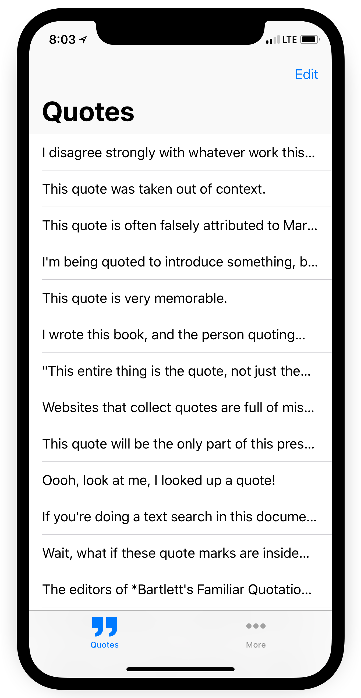

# Adage

	 
	<caption><em>The main quotes list view as of 2018-06-02</em></caption>

Adage is two things:

1. A place for all your favorite quotes to live.
2. An app I'll be developing to learn about iOS development.

I'm working with [Katie Holmes](https://krholmes.com) — a good friend of mine who also happens to be a UX/UI designer — to develop the app. I believe strongly in UX design, and working closely with an intelligent designer has already helped improve the app significantly.

## About

Every so often, I'll hear friends of mine pine for the late [Quotebook](http://quotebookapp.com) app. They'll say they miss the niche that it filled, and its well-designed simplicity. I unfortunately never got a chance to use the app myself, but when I was trying to come up with a good app to work on to help me learn iOS development, the idea of recreating Quotebook was one of the first that came to mind. It is, after all, essentially a <abbr title="Create Read Update Delete">CRUD</abbr> app — a great place to start when learning any new type of development — and would give me a great chance to learn about some of iOS's basic UI elements like table views, navigation controllers, and text fields.

The bare-bones <abbr title="Minimum Viable Product">MVP</abbr> will be a simple list of quotes that are editable by the user, and sortable by date, or by author. Stretch goals will be iCloud sync, and the ability to share quotes to other apps and social networks.

## Participate

### Test

Would you like to beta test the app? Send me an email at [adage@level.software](mailto:adage@level.software), and I'll get you added to the list!

### Development

I'm developing the app in the open because I believe in Open Source, and it would be fun if others wanted to collaborate on the project. I'm new to iOS development, so I am _very_ open to any suggestions you might have. All Issues and Pull Requests are welcome. I'd especially appreciate help on good ways to manage persistence within the app (SQLite? Realm? Core Data?), and iCloud syncing of the persisted data.

## Acknowledgements

- [<cite>Quotebook</cite>](http://quotebookapp.com) - Adage's concept and design derive heavily from Quotebook.

## Resources

All of the resources I used when building Adage:
